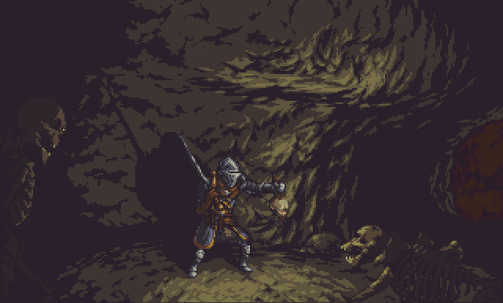

# OnlyOne

Welcome to the Phaser3 RPG Demo!
I created this project to enhance my understanding of JavaScript development through the utilization of the Phaser3 framework. 
It serves as a practical test of my skills in JavaScript game development.
The demo focuses on creating a single-level Object-Oriented an RPG Style game demo specifically for practice purposes.

## Table of Contents
- [Features](#features)
- [Setup](#setup)
- [Resources](#resources)

## Features

* RPG Style: The game follows classic role-playing slasher game mechanics.
* Object-Oriented Design: The codebase is structured using object-oriented principles to enhance maintainability and readability.
* Single Level: As a practice project, the demo features a single level to concentrate on fundamental game development aspects.

## Setup

* Open the project in any JavaScript-compatible IDE that supports a localhost server.
* Run the index.html file to start the demo.

## Resources

The following resources and libraries that were used in the development of this project:

- [Phaser3 Framework](https://phaser.io/): JavaScript Game development framework that served as the foundation for this demo.
- [Tiled editor](https://mapeditor.org): Tiled is a 2D level editor that helped develop the levels of the game.
- [Itch.io ](https://itch.io/): Various game assets that were used in the development of OnlyOne.
